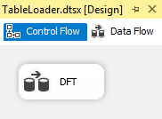
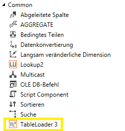
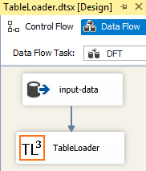
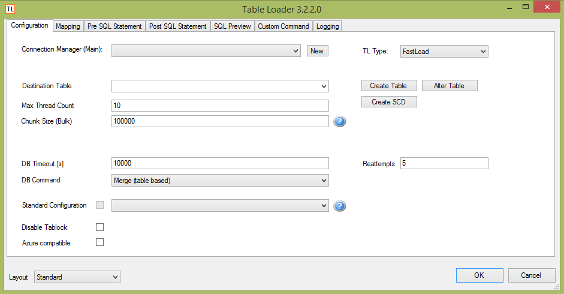
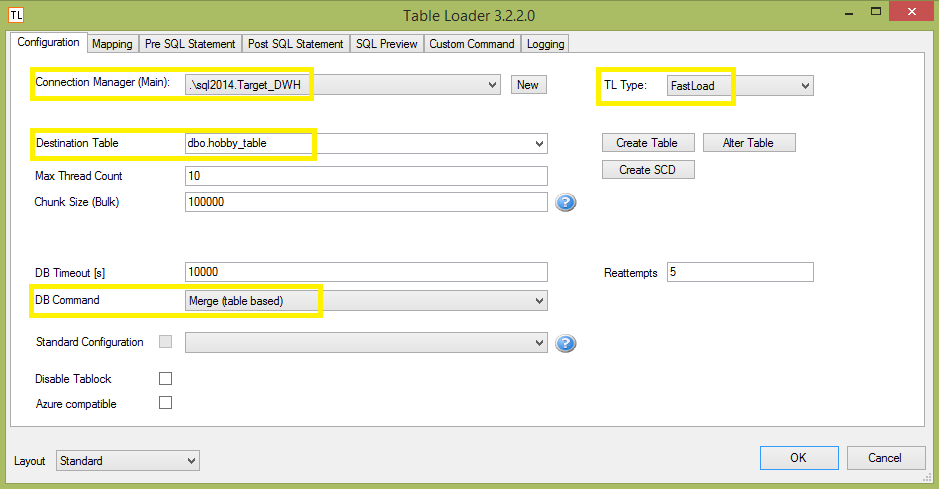
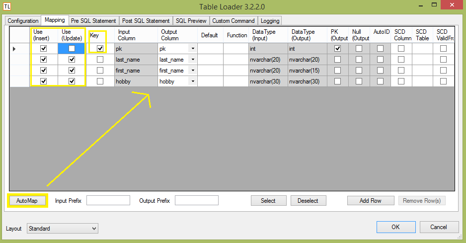

## initions SSIS Component "TableLoader"
"TableLoader" is a custom component for [SQL Server Integration Services](https://en.wikipedia.org/wiki/SQL_Server_Integration_Services). It can be added to the Data Flow of an SSIS-package to merge (insert + update) data into tables. 

In addition this component can automatically map Data Flow columns to target-table columns based on their names.

---

### Requirements for development
* Microsoft VisualStudio 2010 or greater

### Requirements for usage
* Microsoft SSIS 2008R2 / 2012 / 2014

---

### Example 

*Input-data for initial run:*

|pk|last_name|first_name|hobby|
|--|---|---|---|
|1|Smith|John|Rodeo|
|2|Miller|Max|Football|
  
*Target-table after initial run, containing merged (inserted) data written by TableLoader:*

|pk|last_name|first_name|hobby|
|--|---|---|---|
|1|Smith|John|Rodeo|
|2|Miller|Max|Football|

---
*Updated input-data for second run:*
- No data for John Smith (nothing changed here)
- Max Miller has a new hobby
- New entry William Wilson

|pk|last_name|first_name|hobby|
|--|---|---|---|
|2|Miller|Max|*Tennis*|
|3|Wilson|William|Volleyball|
  
*Target-table after second run, containing merged (updated and inserted) data written by TableLoader:*
- unchanged John Smith
- updated Max Miller
- new William Wilson

|pk|last_name|first_name|hobby|
|--|---|---|---|
|1|Smith|John|Rodeo|
|2|Miller|Max|Tennis|
|3|Wilson|William|Volleyball|
  

---

### How to use

1. open SSIS Package
2. create DFT and open it
3. 
4. insert a src-component that gets the data you want to merge via TableLoader into your target-table (i.e. described Input-table)
5. find TableLoader component in SSIS Toolbox, add it to Data Flow
6. 
7. connect output of src-component to input of TableLoader component
8. 
9. open and configure TableLoader component:
    * 
	* on tab "*Configuration*":
    * set an ADO.NET connection manager to your target database
    * set "TL Type":
    	* FastLoad: uses multithreading; you can not use it within a transaction.
    	* TxAll: no multithreading; you can use it within a transaction
    * chose the destination table (i.e. dbo.hobby_table)
    * set DB Command to "Merge (table based)"
    * 
    * on tab "*Mapping*":
    * press "Auto Map" to map input columns to output columns (based on their names)
    * select which columns are used to insert and/or update data
    * at least one "Key" column must be selected to merge data (typically the primary key). Key columns specify the matching columns on which input table is joined with output table.
    * 
10. done

---

### Bugs
If you find a bug, please contact us on GitHub

### Changelog
2016-04-15
First Release

### License
[MIT License](LICENSE)